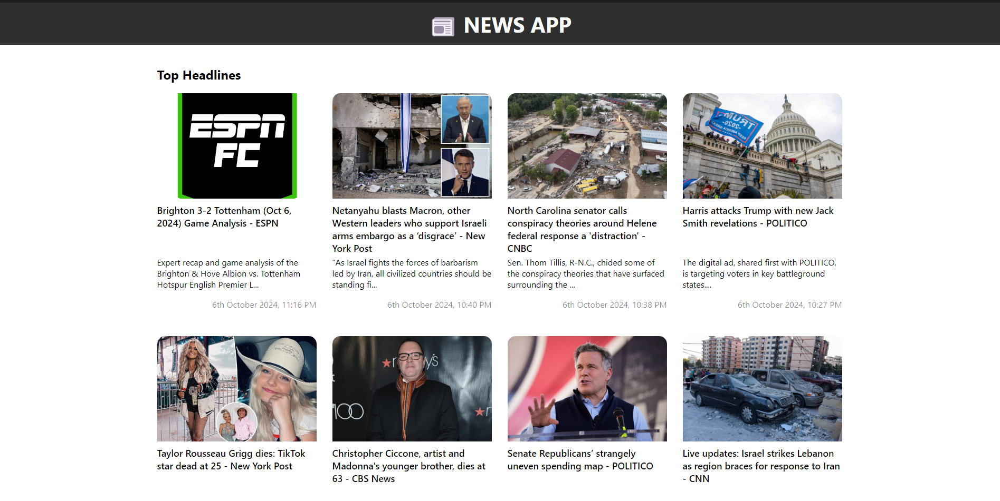

# 📰 NEWS APP


1. I have used React JS for frontend.
2. Used [News API Documentation](https://newsapi.org/docs/endpoints/top-headlines) api to fetch news data.
3. Fetched Data using asyncronous request (Axios library used)
4. Handled error while fetching data from api and other edge cases.
5. Well structed components created.
6. Used loading animation to make UI more user friendly.
7. Used DateFormat library to make news date more readable.

### How to Setup?
- Download the repositiory
- Open termimal and navigate into the project folder `cd News-app`
```
cd News-app
```
- After that install node modules by running `npm install`
```
npm install
```
- Then run the server by `npm run dev`
```
npm run dev
```